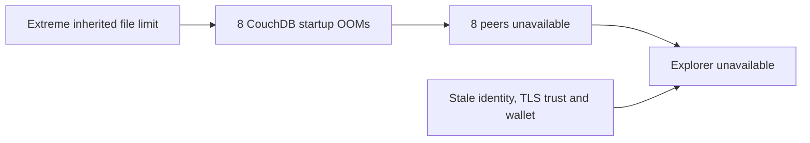

# SRE Postmortems

Evidence-backed incident reports covering impact, diagnosis, recovery,
verification, and remaining reliability work. Each report distinguishes observed
results from hypotheses and records gaps in the retained evidence.

## Incident reports

| Date | Incident | Environment | Outcome |
| --- | --- | --- | --- |
| 2026-09-08 | [Recovering a 17-Pod Hyperledger Fabric Development Outage](incidents/2026-09-08-fabric-couchdb-oom/SRE-POSTMORTEM.md) | TreeTracker development network on kind | Eight CouchDBs, eight Fabric peers and Explorer recovered; legacy governance and storage follow-ups remain |

## Featured incident

An extreme inherited file-descriptor limit caused CouchDB's Erlang runtime to
exceed its 512 MiB container memory limit during startup. The resulting database
failures blocked eight Fabric peers. After database recovery, stale identity,
TLS trust and persisted wallet state separately prevented Explorer initialization.

The fix bounded Erlang port allocation and reconciled Explorer's authorized
identity and trust. Recovery checks covered database health, ledger consistency,
Explorer indexing, HTTP availability and GitOps convergence. Production impact
and exact outage duration were not established.

[Read the postmortem](incidents/2026-09-08-fabric-couchdb-oom/SRE-POSTMORTEM.md)
· [Inspect the public evidence](incidents/2026-09-08-fabric-couchdb-oom/evidence/README.md)

## Evidence and publication

Reports include selected log excerpts, recovery records, provenance and checksums.
Raw archives containing credentials remain private. Redactions and collection
limits are identified explicitly. Historical incident evidence is not a claim
about current runtime health; links to private upstream fixes and CI require
repository access.

This repository publishes incident documentation. It contains no deployment or
recovery automation to run against an existing cluster.
