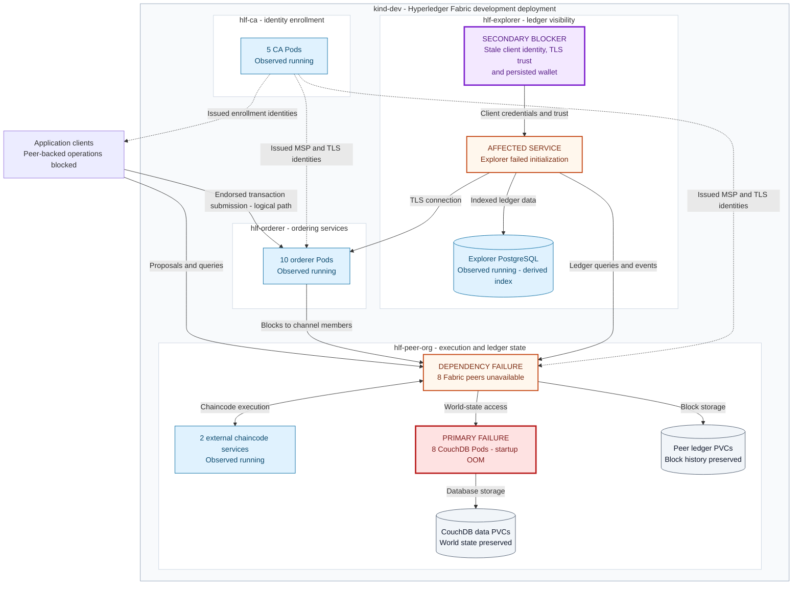

# Hyperledger Fabric Development Outage

## CouchDB Startup OOM and Explorer Identity / TLS Trust Drift

**Incident date:** September 8, 2026 · **Incident ID:** `FABRIC-2026-09-08`

[Full SRE postmortem](2026-09-08-hyperledger-fabric-outage-postmortem.md)
· [Public evidence and logs](evidence/README.md)
· [Dated publication](https://github.com/imos64/sre-postmortem/tree/incident-2026-09-08)
· [All postmortems](../../README.md)

This guide explains the affected Hyperledger Fabric architecture, the failure
sequence, the recovery decisions and the evidence behind the outcome. It describes
the September 8 incident; it is not a new assessment of the running cluster.

## Incident at a glance

| Field | Recorded observation |
| --- | --- |
| Environment | TreeTracker development network, local `kind-dev`, Kubernetes v1.36.1 |
| Affected namespaces | `hlf-peer-org` and `hlf-explorer` |
| Affected application Pods | **17: eight CouchDB databases + eight Fabric peers + one Explorer** |
| Primary failure | CouchDB's Erlang runtime exceeded its 512 MiB container limit during startup |
| Dependency impact | Peers could not initialize their ledger provider; Explorer could not initialize against Fabric |
| Secondary recovery blocker | Explorer had stale signing identity, orderer TLS trust and persisted wallet state |
| Recorded recovery | All 17 workloads ready at 13:43:34 UTC / 09:43:34 EDT on September 8 |
| Impact boundary | Development outage; production impact, external-user count and lost-request count were not established |
| Duration | Exact outage onset and exact MTTR are unknown |

## Contents

- [High-level Hyperledger Fabric architecture](#high-level-hyperledger-fabric-architecture)
- [Component responsibilities and incident impact](#component-responsibilities-and-incident-impact)
- [Organizations and channel participation](#organizations-and-channel-participation)
- [Failure sequence and diagnosis](#failure-sequence-and-diagnosis)
- [Recovery approach](#recovery-approach)
- [Recovery verification](#recovery-verification)
- [Incident timeline](#incident-timeline)
- [Persistence and data integrity](#persistence-and-data-integrity)
- [Follow-up reliability work](#follow-up-reliability-work)
- [Evidence and reading guide](#evidence-and-reading-guide)

## High-level Hyperledger Fabric architecture

The diagram shows logical relationships in the incident's deployment, with the
failure locations marked explicitly. It groups replicas for readability and
omits SDK/Gateway routing details, individual Services and per-channel ordering
membership. The ten observed orderer Pods must not be interpreted as a single
ten-member consensus group.

**Legend:** red = primary OOM failure; orange = unavailable dependent service;
purple = Explorer's separate recovery blocker; blue = observed running during the
initial audit; gray = retained data storage. Labels carry the meaning as well as
colors. The identity/trust box is configuration and wallet state, not an additional
affected Pod. Blue does not imply successful end-to-end service verification.

The CA arrows represent issued identities and trust relationships, not a live CA
request for every transaction. The Explorer trust failure did not mean that the
CA or orderer Pods had crashed. GitOps reconciliation, discussed below, is an
operational control path and is omitted from the transaction diagram.

In Fabric, peers execute and validate transactions and maintain their channel
ledgers; ordering services distribute ordered blocks. The ledger comprises block
history and current world state, while Explorer's PostgreSQL index is a separate
view of that data. These component roles follow the official
[Fabric network architecture](https://hyperledger-fabric.readthedocs.io/en/release-2.5/network/network.html)
and [ledger documentation](https://hyperledger-fabric.readthedocs.io/en/release-2.5/ledger/ledger.html).
Counts and incident status come from the retained [postmortem](2026-09-08-hyperledger-fabric-outage-postmortem.md), not those generic reference diagrams.

## Component responsibilities and incident impact

| Component | Responsibility in this deployment | Incident observation |
| --- | --- | --- |
| Fabric CAs | Identity enrollment and certificate issuance; MSP/TLS trust inputs | Five Pods running; no new identity was minted during recovery |
| Ordering services | Order endorsed transactions and deliver blocks to participating peers | Ten Pods running; existing orderer GitOps drift was outside the repair scope |
| Fabric peers | Endorse/query, validate and commit; maintain channel ledgers | All eight unavailable while their CouchDB dependencies failed |
| CouchDB | Per-peer world-state database | All eight OOM-killed during Erlang startup under a 512 MiB ceiling |
| External chaincode | Business logic for `tree-contract` and `token-contract` | Two services running; this did not restore endorsement while peers were unavailable |
| Explorer | Fabric connectivity, ledger indexing and user-facing visualization | Failed initialization; after connectivity recovery, identity/TLS/wallet drift still blocked it |
| Explorer PostgreSQL | Derived block, transaction and network index | Running; its availability did not make Explorer's Fabric connection functional |
| Persistent volumes | Peer ledgers, database state and persisted Explorer data | Retained during recovery; kind storage remained node-local |
| Argo CD | Reconcile reviewed peer and Explorer GitOps changes | Both affected applications were `Synced/Healthy` at final verification |

## Organizations and channel participation

Each of the eight peer instances had its own CouchDB dependency. Peer readiness
and channel authorization were checked separately.

| Peer organization | Peers | CouchDBs | Channel observations after recovery |
| --- | --- | --- | --- |
| Greenstand | 3 | 3 | `treetracker-v2` height 13 and legacy `treetracker` height 22; matching hashes within each comparison |
| CBO | 2 | 2 | `treetracker-v2` height 13; legacy channel listed but its Readers policy rejected the queried identity |
| Investor | 2 | 2 | Intentionally channel-less in the retained verification |
| Verifier | 1 | 1 | Intentionally channel-less in the retained verification |
| **Total** | **8** | **8** | Five peers verified on v2; three Greenstand peers verified on legacy |

The participating-peer counts are not the same as total deployed-peer counts.
The unresolved CBO legacy Readers-policy failure is retained in
[ledger-verification.json](evidence/ledger-verification.json); recovery did not
bypass that policy or present those queries as successful.

## Failure sequence and diagnosis

### Primary failure: CouchDB startup allocation

The inherited soft and hard `RLIMIT_NOFILE` value was **1,073,741,816**. Erlang
sized startup structures against this extreme descriptor limit, causing CouchDB
to exceed its **512 MiB container memory limit** before normal startup completed.
Kernel evidence identified `beam.smp` in the affected memory cgroup. Node memory
usage was approximately 11–13%, so the retained evidence pointed to per-container
startup allocation rather than general node memory exhaustion.

A diagnostic Pod used the same pinned CouchDB image and memory ceiling, without
data volumes. The controlled comparison changed the Erlang port cap:

| Diagnostic case | Retained result |
| --- | --- |
| `start_clean` with `+Q 65536` | Exit 0; `port_limit=65536`, `memory=23791736` bytes, 20 schedulers |
| Same command without the cap | Exit 137; diagnostic Pod `OOMKilled` |

See the [capped output](evidence/erlang-capped.txt),
[uncapped output](evidence/erlang-uncapped.txt),
[kernel OOM excerpt](evidence/kernel-oom.txt) and
[original investigator summary](evidence/runtime-ab-test.txt).
Apache's [startup-memory troubleshooting guidance](https://docs.couchdb.org/en/stable/install/troubleshooting.html#lots-of-memory-being-used-on-startup)
describes the relationship between descriptor limits and Erlang startup allocation.

### Dependency cascade: peers and Explorer

The peers could not initialize their ledger provider while their CouchDB service
refused connections. Retries exhausted and peer processes failed. Explorer then
failed its default peer/channel initialization. The
[peer connection-refusal excerpt](evidence/peer-couchdb-failure.txt) records this
first dependency failure.

Explorer's fatal initialization path returned exit code 0 in the initial
investigation. Its CrashLoopBackOff state was therefore not itself evidence of an
Explorer OOM. Container termination reasons and application logs were needed to
distinguish the failures.

### Secondary blocker: Explorer identity, trust and wallet state

Once peers recovered, Explorer's historical signing identity was rejected on the
legacy channel and its old CA bundle could not verify the running orderer's TLS
certificate. Its persisted wallet also retained the stale identity despite
changed source credentials.

The existing current-root client identity successfully queried the legacy channel
at height 22, and current orderer trust passed TLS verification. The fix needed
both corrected source configuration and startup reconciliation of the wallet.
See the [TLS failure](evidence/explorer-tls-failure.txt),
[identity validation summary](evidence/explorer-identity-validation.txt) and
[wallet refresh output](evidence/explorer-wallet-refresh.txt).

The previous worker-container restart is a plausible trigger for exposing the
inherited limit. The exact actor/configuration change that introduced that limit
and the exact beginning of the outage remain unestablished.

## Recovery approach

| Step | Change and purpose | Preserved boundary |
| --- | --- | --- |
| 1. Stabilize CouchDB | Add `ERL_FLAGS="+Q 65536"` to all eight deployments; add rendered-overlay regression checks | Same image digests, 512 MiB limits, CPU settings, security contexts, PVCs and `Recreate` strategy |
| 2. Recover peer startup | Reset five peers still in backoff after the databases recovered; three recovered through retries | No ledger reset or PVC deletion |
| 3. Correct Explorer connectivity | Use the existing current-root client identity and current orderer TLS trust | No new identity, channel-policy change or disabled TLS verification |
| 4. Reconcile the wallet | Validate certificate/key agreement, replace stale entries atomically, enforce mode `0600`, and leave matching entries unchanged | Preserve wallet volume and application/database contents |
| 5. Verify and remove diagnostics | Check service, ledger and index behavior; remove incident diagnostic Pods | Retain the evidence and unrelated workloads |

Peer fix: `fe1b20d30f20a32b5b4e36c76c00da6a802b4712`.
Explorer fix: `3e349bfd8f52af8f634a2e75ddf4406db3ad19c3`.
Argo reconciled those corrective revisions in the affected development
applications. CI checked the CouchDB cap and Explorer wallet behavior; see
[historical CI results](evidence/ci-runs.json). Original Git/CI links in the full
report require access to the private upstream repositories.

These are historical recovery decisions. Reverting the cap before correcting the
inherited limit can recreate the OOM; reverting Explorer's identity/trust can
recreate the authorization/TLS failure. The report is not an unattended recovery
procedure for another cluster.

## Recovery verification

Recovery was checked at several layers rather than inferred from Pod readiness.

| Layer | Recorded result | Evidence |
| --- | --- | --- |
| Database health | Eight authenticated `/_up` responses returned `status=ok` | [CouchDB responses](evidence/couchdb-up.json) |
| Workload stability | All 17 affected workloads ready; no restart-count increases between the final snapshots | [Final verification](evidence/final-verification.json) |
| Database memory | Approximately 84–103 MiB observed after recovery under unchanged 512 MiB limits | [Detailed postmortem](2026-09-08-hyperledger-fabric-outage-postmortem.md#recovery-verification) |
| Current channel | Five peers at height 13 with matching current/previous hashes | [Ledger verification](evidence/ledger-verification.json) |
| Legacy channel | Three Greenstand peers at height 22 with matching hashes; CBO policy failures remain explicit | [Ledger verification](evidence/ledger-verification.json) |
| Explorer indexing | Legacy 22 blocks/22 transactions; v2 13 blocks/13 transactions | [Detailed postmortem](2026-09-08-hyperledger-fabric-outage-postmortem.md#recovery-verification) |
| User-facing access | Explorer HTTP 200; replacement Explorer older than five minutes with zero restarts | [Final output](evidence/final-verification-output.txt) |
| GitOps | Peer and Explorer applications `Synced/Healthy` at corrective revisions | [Final verification](evidence/final-verification.json) |

Three original peer Pods recovered through retry and retained their historical
restart counts; a ready Pod does not imply a lifetime restart count of zero.
The zero-restart observations apply to the replacement CouchDB Pods and Explorer.
No new synthetic business write, token transfer, CA enrollment or governance
transaction was submitted. Matching observed ledger hashes do not establish
that no client requests were lost during the outage.

## Incident timeline

All times below are UTC on September 8 unless a different date is shown. EDT is
UTC minus four hours; approximate times retain that qualification.

| Time | Milestone |
| --- | --- |
| Sep 7, 21:30:56 | Worker-container start timestamps; plausible trigger, not a proven outage onset |
| 13:19–13:27 | Retained peer connection failures, Explorer initialization failures and cgroup OOM records |
| Approximately 13:28–13:29 | Isolated diagnostic Pod and capped/uncapped Erlang comparison |
| 13:30 | CouchDB cap published; successful database startup observed |
| Approximately 13:31–13:32 | Remaining peers reset; all eight peers ready |
| Approximately 13:34–13:35 | Existing authorized client and current orderer trust validated |
| 13:37:57 | Replacement Explorer container started; wallet refresh completed |
| 13:40 | Database, ledger, Explorer and GitOps recovery checks passed |
| 13:43:34 | Final stability snapshot: all 17 affected workloads ready |

The [full timeline](2026-09-08-hyperledger-fabric-outage-postmortem.md#timeline)
explains capture limitations. Pod age and restart counts are not measurements of
continuous downtime, and the retained records do not support an exact MTTR.

## Persistence and data integrity

Peer block history, CouchDB world state and Explorer's derived PostgreSQL index
have different roles. Recovery preserved the existing volumes and identities;
no PVC, ledger, CA database or wallet volume was deleted or reinitialized.

Existing PVC node affinity kept databases associated with their backing kind
workers during replacement. Despite the storage-class name `do-block-storage`,
the deployment used node-local paths. Restored Pod availability does not protect
that state from loss of the kind node or workstation.

The incident did not refresh or restore-test an off-cluster recovery snapshot.
GitOps preserves the corrective configuration; it does not back up runtime data.
Backup refresh and a demonstrated restore remain separate follow-up work.

## Follow-up reliability work

These statuses reflect the incident report's action register. Owner roles are
proposals, not assignments or claims of later completion.

| Priority | Action | Acceptance evidence | Status in incident report |
| --- | --- | --- | --- |
| P0 | Bound Erlang startup allocation | Cap present in eight rendered deployments and runtime health checked | Completed |
| P0 | Correct Explorer identity/trust and wallet refresh | Both channels indexed; mismatch and idempotence regressions checked | Completed |
| P1 | Control container runtime `nofile` defaults | Controlled worker restart with the per-application cap retained and runtime/service checks | Open |
| P1 | Verify alert routing for OOM, CrashLoop and Fabric availability | Delivered alert and recovery notification | Open |
| P1 | Add functional readiness checks | Intended channel query with the actual client identity and verified endpoint trust | Open |
| P1 | Exercise identity rotation | Secret update, controlled restart, wallet refresh and real channel query | Open |
| P1 | Refresh and restore-test recovery snapshots | Successful isolated restore including both corrective revisions and persisted state | Open |
| P2 | Resolve legacy CBO trust/governance debt | Authorized channel-governance process; no policy bypass | Open |

The orderer application's pre-existing GitOps drift was observed but not repaired
as part of this incident. It requires separate investigation.

## Evidence and reading guide

| Resource | Use |
| --- | --- |
| [Full dated SRE postmortem](2026-09-08-hyperledger-fabric-outage-postmortem.md) | Detailed narrative, original decisions, timeline and private-archive inventory |
| [Public evidence index](evidence/README.md) | Selected logs and verification files with capture limits |
| [Provenance](evidence/PROVENANCE.json) | Original source references, selected line numbers, transformations and hashes |
| [Public checksums](evidence/SHA256SUMS) | Verify the published evidence bytes |

The five original summary/verification files are published byte for byte; seven
command-output files are selected excerpts. Color escapes were removed and one
private Service IP was replaced with a placeholder. The full 195-file archive
remains private because it contains configuration credentials.

The original commands used `--tail`, `--since` and filtering. Three private output
chunks were already truncated when captured; missing content has not been
recreated. No live Loki/Prometheus export or new cluster inspection was performed
for this documentation. Public evidence is a bounded historical record, not a
complete lifetime log or a production certification.
