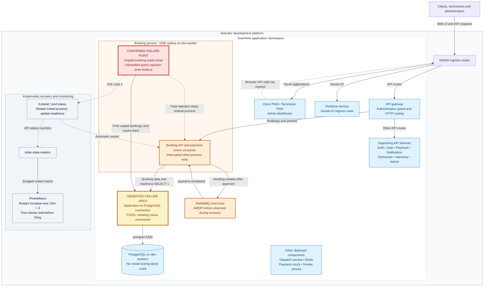

# Fixam4me Booking Service Restart Incident

**Incident:** `BOOKING-2026-09-16` · **Environment:** development, `kind-dev` / `fixam4me` · **Alert:** warning

[Full SRE postmortem](2026-09-16-booking-service-restarts-postmortem.md)
· [Public evidence and logs](evidence/README.md)
· [All postmortems](../../README.md)

Booking-service repeatedly restarted after dependency failures. The latest retained
crash shows a database query rejection escaping the unpaid-booking expiry task and
terminating the application process. The platform architecture below locates that
failure inside the application and shows the affected dependency path.

This guide describes the September 16 evidence. Recovery was observed at the time;
the application defect and underlying connectivity investigation remained open.

| Observation | Recorded result |
| --- | --- |
| Restart history | 44 additional main-container restarts, 00:00–08:23 UTC; 51 lifetime restarts |
| Detection | Six sampled firing periods; rule inactive at 08:22:46 UTC |
| Availability exposure | One booking replica; approximately 49 minutes of sampled NotReady time, not measured request downtime |
| Latest failure | Prisma `P1001` in `expireUnpaidBookings`; process exit 1 at 08:00:53 UTC |
| Recovery | Same pod restarted automatically; Ready at 08:01:25 UTC |
| Final verification | 08:24:37 UTC: 51 restarts, Ready, successful health and readiness responses |
| Unresolved | Why dependency connectivity failed; actual request/customer impact; durable remediation |

## High-level application and platform architecture

The diagram follows the user-facing application path and locates the confirmed
process failure separately from the unresolved connection failure. Supporting
services are grouped for readability. This is the observed development deployment,
not an AWS reference architecture or a claim that production was affected.

**Legend:** red marks the confirmed application failure; yellow marks observed
connection failure whose initiating cause is unresolved; orange marks application
interruption or observed retry symptoms; blue provides architecture context, not
an assertion of continuous health. Dashed arrows show logical browser return or
operational effects. `DBPATH` is a connection path, not an additional deployed
component. `HTTP` and `TASK` share one Node.js process, not separate replicas.

The ingress and gateway relationships are supported by the published
[ingress routing snapshot](evidence/ingress-routes.json) and
[runtime gateway routes](evidence/gateway-routes.txt), captured during publication
preparation. The [booking runtime excerpt](evidence/runtime-source-excerpt.txt)
identifies the data query, payment consumer context, event publication, and timer.
The [workload inventory](evidence/workload-inventory.json) establishes the other
deployed components. AUX is deliberately an inventory group: its individual
runtime dependencies were not inspected in this incident, so no speculative
arrows are drawn. Notification delivery and unrelated platform controllers are
omitted. Kubernetes control-path arrows summarize status/restart behavior rather
than representing direct kubelet-to-exporter network calls.

## How the failure propagated

1. The booking process could not obtain a usable PostgreSQL connection. Readiness
   logs first show a pool acquisition timeout, then database reachability errors.
2. Its one-minute expiry task called `prisma.booking.findMany()` outside the
   per-booking `try/catch` block.
3. The timer used `void expireUnpaidBookings()` without a rejection handler.
   The rejected query terminated Node.js with exit code 1.
4. Because the expiry task, HTTP API and event consumer shared the same process,
   one task failure interrupted the entire booking replica. There was no second
   replica to carry booking traffic.
5. Kubernetes restarted the process. AMQP connection retries delayed startup;
   readiness returned after the application could initialize and query its DB.

The latest exit-to-Ready interval was 32 seconds. It does not include degradation
before the exit and is not the incident MTTR. A successful restart did not remove
the unsafe timer code. The PostgreSQL process remained running during the latest
crash; that does not prove the application could reach it. Correlated readiness
failures in other services and AMQP retry symptoms warrant a shared connectivity
investigation, but do not prove a CNI, DNS, host, or database-capacity fault.

## Impact and recovery boundary

The incident affected development booking-service availability. The report does
not establish production impact, lost booking data, a count of failed requests,
or specific payment outcomes. The approximately 49-minute estimate comes from
sampled pod readiness, with a monitoring gap and query-timing limitations.

Recovery was automatic. The investigator made no application or infrastructure
changes. Health and readiness passed through the Kubernetes service proxy; a
full user booking/payment journey was not tested. All current-state statements
are bounded to the historical verification times above.

## Corrective work and acceptance

| Priority | Proposed work | Acceptance |
| --- | --- | --- |
| P1 | Handle errors around the entire expiry job, prevent overlapping runs, and add bounded retry/backoff | Injected dependency failures cause no unhandled rejection or process exit; readiness remains truthful |
| P1 | Investigate the shared dependency/connectivity trigger | Timestamped DB, network and host evidence identifies or eliminates hypotheses |
| P1 | Verify expiry/payment concurrency and message redelivery | No duplicate cancellation, promo side effects, or overwritten payment state |
| P2 | Add availability and scheduled-job signals; review connection budgets and probe timing | Detect readiness-only outages and failed expiry work without requiring crashes |
| P2 | Evaluate replicas or a separate expiry worker after concurrency safeguards | Replica failure does not interrupt service or duplicate scheduled side effects |

Owners, proposed deadlines, remaining evidence gaps, and closure criteria are in
the [full report](2026-09-16-booking-service-restarts-postmortem.md). None of these
corrective actions is represented as implemented by this publication.

## Reading the evidence

Start with the [previous process log](evidence/booking-previous.txt),
[pod termination state](evidence/pod.txt), and
[deployed task code](evidence/runtime-source-excerpt.txt) for the latest crash.
Use [restart history](evidence/restart-history.json) and
[alert history](evidence/alert-history.json) for recurrence. The
[evidence index](evidence/README.md) documents transformations, limitations and
checksums; the private raw collection is not published wholesale.
