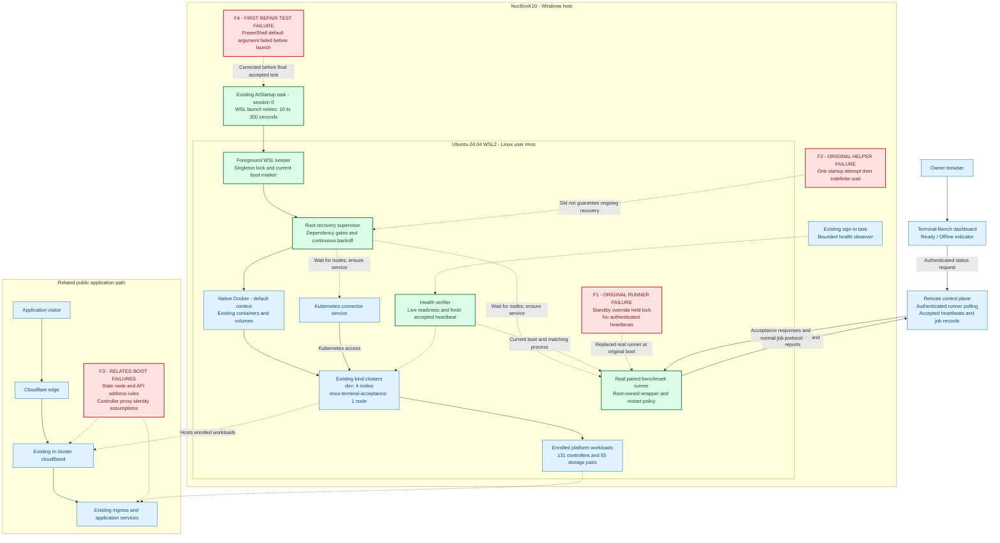

# Windows/WSL Platform Recovery and Terminal-Bench Runner Offline

**Incident:** `RUNNER-2026-09-19` · **Platform:** NucBoxK10, Windows / Ubuntu-24.04 WSL2 / native Docker / kind

**Outcome:** automatic recovery before Windows sign-in demonstrated after an actual reboot.

[Full SRE postmortem](2026-09-19-windows-wsl-runner-recovery-postmortem.md)
· [Evidence and logs](evidence/README.md)
· [Operations and rollback](RUNBOOK.md)
· [Corrective actions](ACTIONS.md)
· [All incidents](../../README.md)

After a Windows restart, the dashboard correctly showed **Runner Offline** even
though the runner service was active. A dormant service override started a standby
process that held the runner lock but never authenticated or sent heartbeats.
Startup and supervision also had gaps: a helper attempted recovery once, and a
running task did not establish either platform health or WSL lifetime.

The repair restored the real runner, added dependency-aware continuous recovery,
and retained the existing clusters and data. The third actual reboot established
full readiness and sustained accepted heartbeats before any Windows user signed
in. The first failed repair test and the second incomplete qualification remain
part of the record.

| Final reboot milestone, 2026-09-20 UTC | Recorded time |
| --- | --- |
| Windows boot | 02:58:25.500 |
| Existing session 0 boot task launched wrapper | 02:59:07.619 |
| Full platform readiness | 03:01:21.273 |
| Automatic sustained-heartbeat proof completed | 03:04:38.994 |
| First Windows console sign-in | 03:11:24.500 |
| First post-boot investigator read | 03:13:51 |

All five nodes and 131 enrolled controllers passed verification. All 55 PVC/PV
pairs were preserved. Independent control-plane samples confirmed continued
heartbeat acceptance, and the owner refreshed the dashboard and confirmed Ready.
These statements describe the recorded incident checks, not perpetual availability.

## Application and platform architecture

The diagram separates the benchmark application path, host recovery controls, and
related public ingress path. Red boxes identify confirmed historical failure
points; green boxes show the installed recovery path. Dashed edges are supervision,
verification, or historical effects rather than application traffic.

The runner and connector execute as Linux user `imos`; their supervision files
are root-owned. The remote control plane is outside this host. The diagram does not assert that
benchmark status traffic traverses the affected TreeTracker tunnel. The runner's
original no-heartbeat defect and the related Cloudflare 1033 had distinct proven
mechanisms. F4 was introduced during this repair and corrected after a real reboot
exposed a gap in the mocked invocation test.

Docker Desktop was installed, but the enrolled clusters used **native Ubuntu
Docker**, context `default`, at `/var/run/docker.sock`. No engine migration was
performed. Before-sign-in recovery was provided by the existing Windows boot task,
foreground WSL keeper, and Linux supervision, with Windows sign-in settings
unchanged. A sign-in-only Desktop startup setting was not treated as boot recovery.

## Acceptance boundary

The final automatic observer recorded 12 accepted heartbeat timestamps across
180.21 seconds. Windows observers accumulated 121 known signed-out samples through
03:09:12; console sign-in was later. Three independent control-plane observations
then advanced over another 126.439-second observation window. The owner separately
confirmed the authenticated dashboard was Ready.

The final health snapshot retained two existing orderer headless-service endpoint
warnings. No paid benchmark trial or business write transaction was used to prove
recovery. Preservation checks covered the existing clusters, 55 storage pairs,
51 retained job/draft/refresh records, and 4,209 files within the documented hash
and size-check scope.

The [full report](2026-09-19-windows-wsl-runner-recovery-postmortem.md) distinguishes
recovery evidence, safety constraints, remaining gaps, and proposed future work.
The [evidence index](evidence/README.md) identifies selected logs, transformations,
source provenance, and checksums. Private raw archives remain outside this repository.
